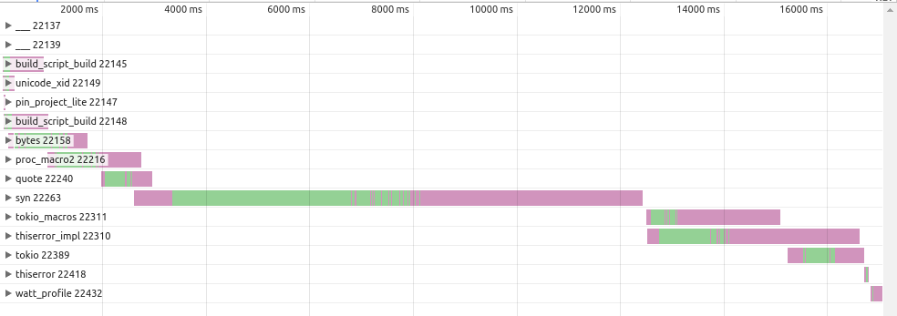
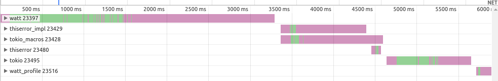

# cargo watt

> Watt is a runtime for executing Rust procedural macros compiled as WebAssembly.

I assume you are familiar with [watt](https://github.com/dtolnay/watt/blob/master/README.md), dtolnay's crate for executing procedural macros in a [web assembly](https://webassembly.org/) interpreter.

There, tooling improvements are listed as _remaining work_, and this cargo subcommand aims to achieve that.
Its purposes are

1. build proc-macro crates without manual intervention for the watt runtime
2. verify that a wasm file is compiled from a particular source

# Building proc-macro crates (`cargo watt build`)

Building works by first copying a crate (either from a local directory, a git repository or crates.io) into `/tmp`.
The crate type is then changed to `cdylib`, `proc-macro2` is being patched to dtolnay's `proc_macro2`.
Next, all procedural macros in it are being replaced with `pub #[no_mangle] extern "C" fn` according to [this](https://github.com/dtolnay/watt#getting-started).

At this point, simple crates already compile, but there is more to be done to support a wider range of crates. Since we just change some signatures and hope for the best, sometimes stuff stops working. To 'fix' that (altough it's more of a hack), we do the following:

- replace `syn` with [this syn patch](https://github.com/jakobhellermann/syn-watt), which basically has all instances of `proc_macro` replaced with `proc_macro2` and the conditional compilation for `wasm32-unknown-unknown` is removed
- do a literal search and replace of `proc_macro` to `proc_macro2`. This may sound stupid, but in my testing this works alright.

Of course, some crates still don't compile, in that case you need tweak things yourself.
Notably, anything depending on `synstructure` or `syn-mid` won't work, maybe patches for those will be provided in the future aswell.

Lastly, a shim crate is generated which calls into the generated web assembly file and executes the token tree transformation.

As a user, all you need to do is

```sh
$ cargo watt build --crate serde-derive
  INFO  cargo_watt > download crate 'serde-derive' into temporary directory...
  INFO  cargo_watt > begin compiling crate...
     Updating git repository `https://github.com/dtolnay/watt`
     Updating git repository `https://github.com/jakobhellermann/syn-watt`
     Updating crates.io index
    Compiling syn v1.0.22 (https://github.com/jakobhellermann/syn-watt#0f0ace5e)
    Compiling serde_derive v1.0.110 (/tmp/cargo-watt-crate)
     Finished release [optimized] target(s) in 19.65s
  INFO  cargo_watt > finished in 19.65s
  INFO  cargo_watt > compiled wasm file is 2.65mb large
  INFO  cargo_watt > generated crate in "serde_derive-watt"
```

Alternatively you can fetch a git repository (`cargo watt build --git https://github.com/idanarye/rust-typed-builder`) or use a local path (`cargo watt build ./path/to/crate`).

By default, `cargo watt` will include all files of original crate (i.e. tests, documentation etc.) in the newly generated one.
If you'd like to only have `Cargo.toml`, `src/lib.rs` and `src/the-macro.wasm` there is the `--only-copy-essential` option.

## Caveats

Some proc-macro crates need to export other things then the actual macros, so they are split into a regular rust crate exporting some Traits/Functions, which then reexports the macros from another crate.

This is why `cargo watt --crate thiserror` will tell you that thiserror is not a proc macro crate.

Instead you would need to do `cargo watt --crate thiserror-impl`, clone `thiserror` and change it's `impl`-dependency to our generated watt crate.

Maybe this will be automated by `cargo watt` in the future but until then this is a limitation.

# Verifying compilation (`cargo watt verify`)

The isolation properties of running the macro inside web assembly ensure that it doesn't have unwanted access to files or the network, but the code it generates can still be mailcious.
Therefor it is important to be able to verify that a compiled binary wasm file was indeed compiled by some source, which can then be audited manually.

Just as the build subcommand, `cargo watt verify` works with local projects, remote git repos and crates.io crates, you can use it like this:

```sh
$ cargo watt build --crate serde-derive
 ...
$ cargo watt verify serde-derive_watt/src/serde-derive.wasm --crate serde-derive
 INFO  cargo_watt::wasm > finished in 17.3s
 Success!
```

Currently though, a crate compiled an linux will be [different](https://gist.github.com/jakobhellermann/da18d6f2da58414e0fd9c06ae708d2c1) than on macos.
If you know why this is and how to fix it, let me know.

---

## Performance

How much of a difference does this make regarding compile times?

I profiled a crate with the following dependencies:

```toml
tokio = { version = "0.2", features = ["macros"] }
thiserror = "1.0"

[patches.crates-io]
tokio-macros = { git = "https://github.com/jakobhellermann/watt-contrib" }
thiserror-impl = { git = "https://github.com/jakobhellermann/watt-contrib" }
```

Without the patches:



With patches:



That's a difference of 6 seconds vs 17 seconds, so not bad.
Of course, in a real project you're gonna have a more non-macro crates, but it's still faster.

<br>

#### LICENSE

MIT © [Jakob Hellermann](mailto:jakob.hellermann@protonmail.com)
